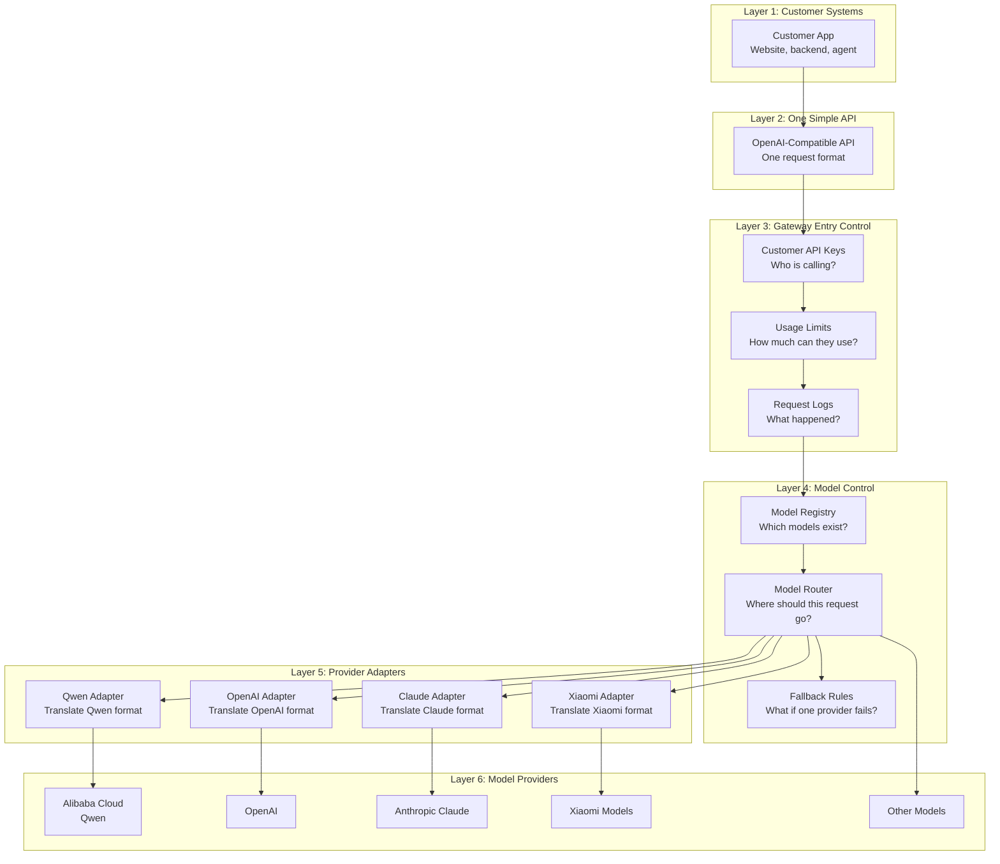
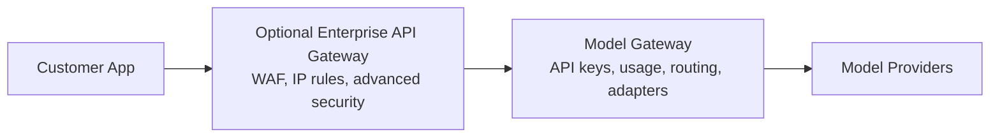
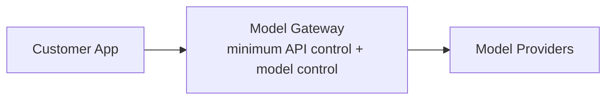
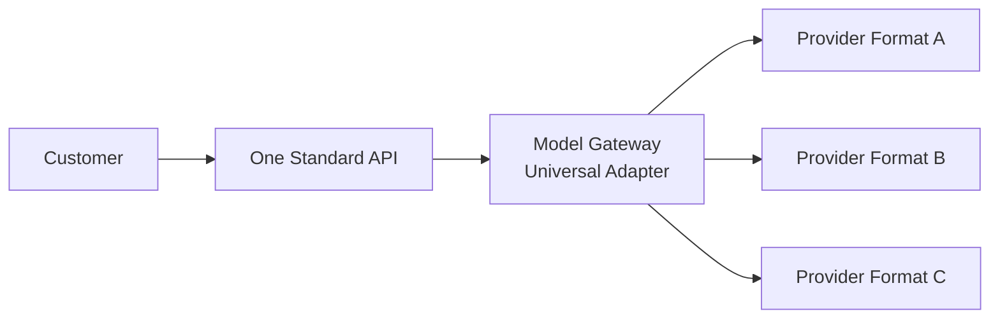
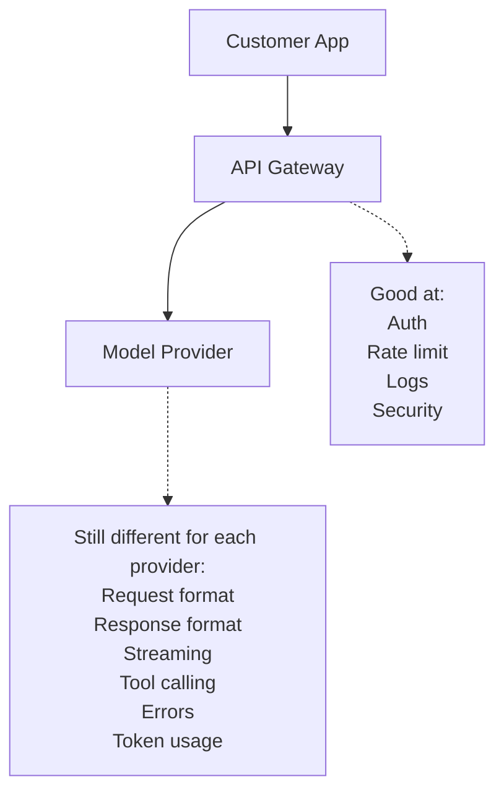
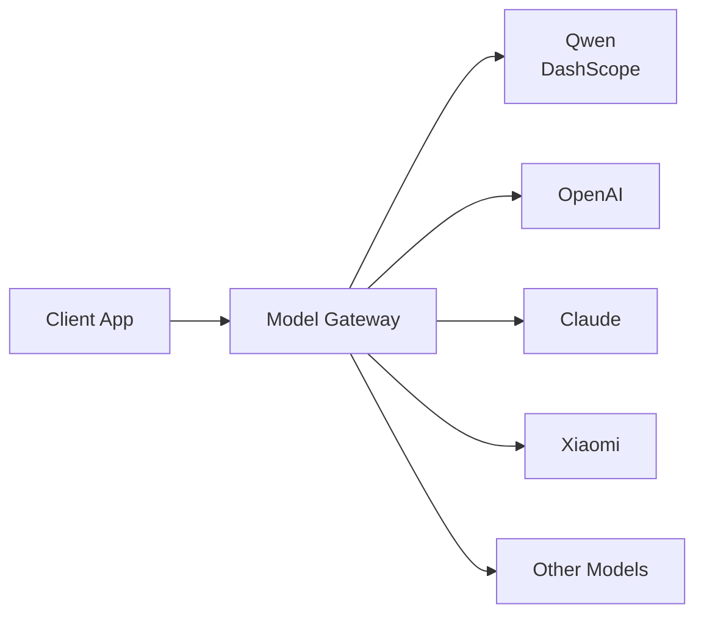
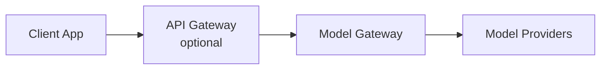
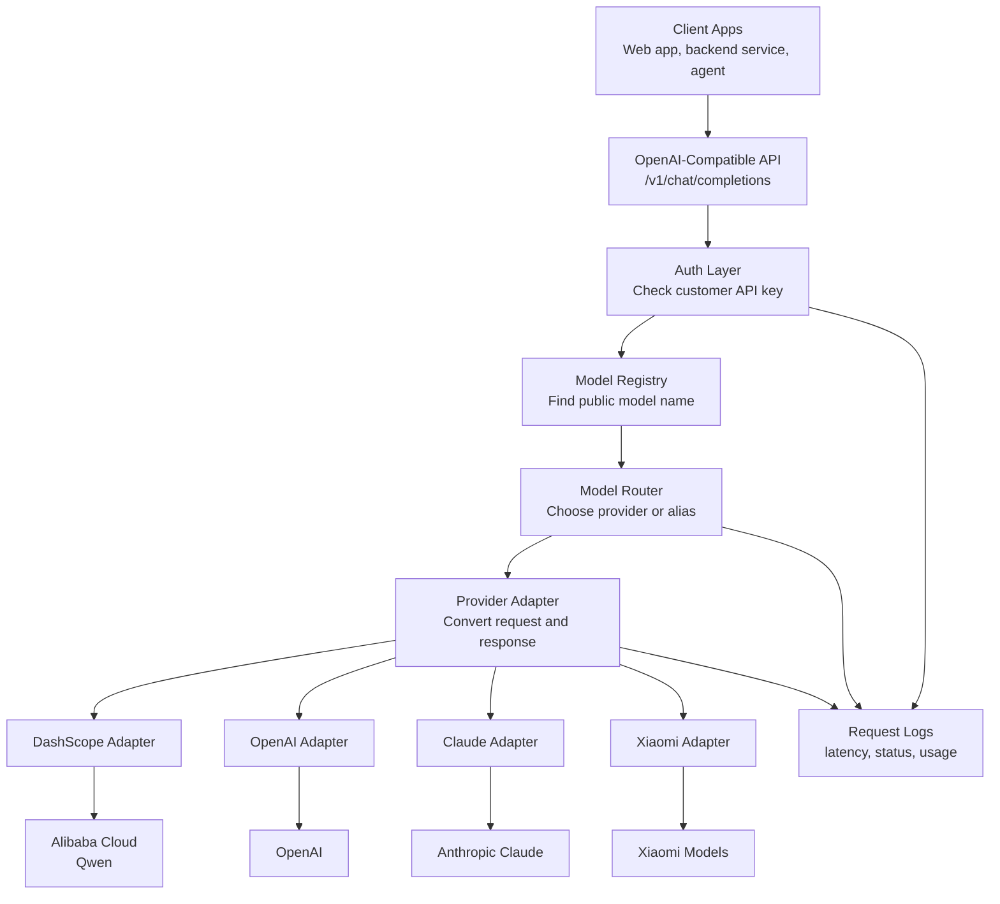
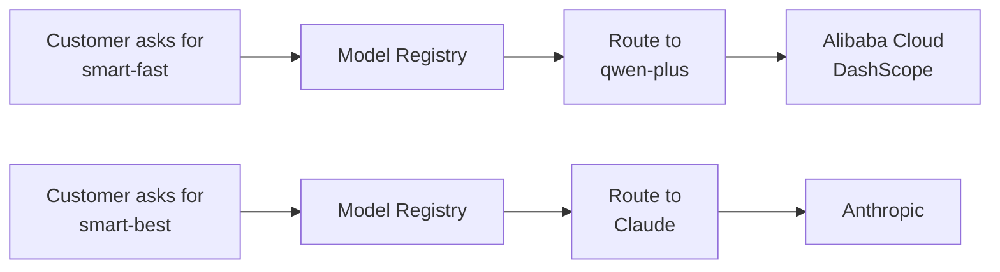
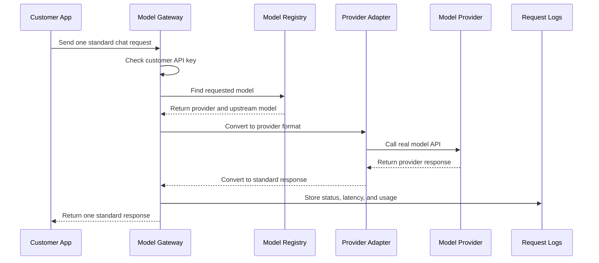

# Model Gateway Prototype

## Executive Summary

We want to build one simple AI API for many model providers.

Customers should not need to learn many different AI APIs.

They should call one API, and the Model Gateway will handle the provider differences behind the scenes.

In simple words:

- The customer sends one standard request.
- The gateway chooses the right model.
- The gateway talks to the real provider.
- The customer receives one standard response.

## Layered Architecture

This picture is the most important view for non-technical readers.

Each layer has one clear job.



### Layer Summary

| Layer | Simple Meaning | Example |
| --- | --- | --- |
| Layer 1 | The customer system | A website, app, backend, or AI agent |
| Layer 2 | One simple API | The customer sends one standard request |
| Layer 3 | API entry control | Check API key, usage limit, and request logs |
| Layer 4 | Model decision layer | Choose model, route provider, apply fallback |
| Layer 5 | Translation layer | Convert our request into provider format |
| Layer 6 | Real model providers | Qwen, OpenAI, Claude, Xiaomi, other models |

The customer mainly sees Layer 1 and Layer 2.

Our product handles Layer 3, Layer 4, Layer 5, and Layer 6.

## Purpose

We want to build a small prototype for a model gateway.

The goal is to call many AI model providers through one simple API.

Example providers:

- Alibaba Cloud Model Studio / DashScope / Qwen
- OpenAI
- Anthropic Claude
- Xiaomi models
- Other cloud or private models

This is similar to the basic idea of OpenRouter, but smaller and controlled by us.

## Important Idea

An API Gateway is not enough by itself.

An API Gateway is good for normal HTTP traffic.

It can help with:

- Authentication
- Rate limits
- Logs
- Monitoring
- Security rules
- Request routing

But AI model integration has extra problems.

Different model providers use different request formats, response formats, streaming formats, error formats, and tool calling formats.

So we need a Model Gateway.

## Does This Include API Gateway Features?

Yes, the prototype includes the minimum API Gateway-like features needed to manage users.

These features are inside the Model Gateway service for the first version.

Included in the prototype:

- Customer API key authentication
- Basic usage limit per key
- Basic request logs
- Basic usage tracking
- Persistent SQLite records
- Basic model access control
- Basic route decision summary
- Basic local safety preview
- Basic fallback routing
- Basic request-level provider allow-list
- Basic request-level routing strategy control
- Basic named policy presets
- Basic customer default policy
- Basic production readiness report
- Basic incident playbook
- Basic support policy
- Basic pilot checklist
- Basic executive brief
- Basic roadmap
- Basic decision guide
- Basic FAQ
- Basic capability routing control
- Basic provider create, update, and disable workflow
- Basic provider contract matrix
- Basic model route create, update, and disable workflow
- Basic customer key issue preview
- Basic OpenAPI contract export
- Basic Postman collection export
- Basic demo bundle manifest
- Basic customer integration guide
- Basic customer key create, rotate, and disable workflow
- Basic audit events for customer key lifecycle changes
- Basic customer self-service profile
- Basic invoice preview with CSV export
- Basic customer plan, token budget, and cost budget control
- Basic Bring Your Own Key provider mapping
- Provider adapter scaffolds for OpenAI-compatible APIs and Anthropic-style APIs
- Basic error response format

Not included in the first prototype:

- WAF
- IP allowlist
- Enterprise single sign-on
- Advanced audit policy
- Global traffic control
- Advanced rate limit rules
- Full billing dashboard

Those can be added later by putting a full API Gateway or edge gateway in front of the Model Gateway.



For the prototype, we can start simpler.



## Non-Technical Explanation

Different AI providers are like different power plugs.

The customer does not want to carry many adapters.

The Model Gateway acts like one universal adapter.



The customer sees one simple interface.

We handle all provider-specific details inside the gateway.

## Simple Difference

| Layer | Main Job |
| --- | --- |
| API Gateway | Controls HTTP traffic |
| AI Gateway | Adds some AI traffic management features |
| Model Gateway | Understands model APIs and provider differences |
| Model Router | Chooses which model or provider to use |
| Provider Adapter | Converts one provider format to our standard format |

## Why API Gateway Is Not Enough

An API Gateway can control the front door.

But it usually does not understand AI model behavior deeply.



The missing part is the Model Gateway.

The Model Gateway understands the AI provider differences.

## Current Prototype Scope

The current version is still simple, but it is no longer only a route demo.

It now has a small product skeleton:

- Customer keys in `customer_keys.json`
- Model and provider rules in `model_registry.json`
- Request and usage records in SQLite
- Customer plan controls for request limit, token budget, and cost budget
- JSONL logs for easy local inspection
- Mock streaming
- Mock fallback routing
- OpenAI-compatible provider adapter
- Anthropic adapter scaffold
- BYOK mapping through environment variables

This is enough to explain the direction to customers.

It is not enough for production billing or enterprise security yet.

## Recommended First Architecture

For the prototype, we can start without a cloud API Gateway.



Later, if we need enterprise control, we can put an API Gateway in front.



This keeps the design clear.

The API Gateway controls general traffic.

The Model Gateway controls AI model behavior.

## Technical Target Architecture



### What Each Part Means

| Part | Simple Meaning |
| --- | --- |
| Client Apps | The systems used by customers |
| OpenAI-Compatible API | One common API format that many tools already understand |
| Auth Layer | Checks who is calling the gateway |
| Model Registry | A list of available model names |
| Model Router | Decides where a request should go |
| Provider Adapter | Translates between our format and the provider format |
| Request Logs | Records what happened for support, cost, and monitoring |
| Customer Budget | Controls how much each customer can use |

## OpenRouter Reference Concepts

This design is not a copy of OpenRouter.

But it uses some public concepts that OpenRouter also shows in its documentation.

| Concept | How OpenRouter Shows It | How We Use It |
| --- | --- | --- |
| One API for many models | OpenRouter exposes an API with schemas similar to the OpenAI Chat API | We expose an OpenAI-compatible API for customers |
| API keys | OpenRouter uses Bearer token API keys | We use customer API keys for our gateway |
| Credit or usage limits | OpenRouter documents key limits and remaining credits | We add request limits, token budgets, and cost budgets per customer key |
| Usage tracking | OpenRouter exposes key usage fields such as daily, weekly, and monthly usage | We store request logs and usage records |
| Model listing | OpenRouter has a models API for listing model properties | We use a model registry and `/v1/models` |
| Routing | OpenRouter documents provider and model routing concepts | We use a model router and request-level provider allow-list |
| Fallback | OpenRouter supports fallback models when a model or provider fails | We include registry fallback and request-level fallback controls |
| BYOK | OpenRouter supports bring-your-own provider keys | We support a simple environment-variable BYOK mapping in the prototype |
| Normalization | OpenRouter describes normalizing schemas across models and providers | We use provider adapters to normalize requests and responses |

References:

- [OpenRouter API Reference](https://openrouter.ai/docs/api/reference/overview/)
- [OpenRouter Authentication](https://openrouter.ai/docs/api-keys)
- [OpenRouter Limits](https://openrouter.ai/docs/api-reference/limits/)
- [OpenRouter Models API](https://openrouter.ai/docs/api/api-reference/models/get-models)
- [OpenRouter Model Fallbacks](https://openrouter.ai/docs/guides/routing/model-fallbacks)
- [OpenRouter Provider Routing](https://openrouter.ai/docs/guides/routing/provider-selection/)
- [OpenRouter BYOK](https://openrouter.ai/docs/use-cases/byok/)

## Internal Standard API

The prototype should expose an OpenAI-compatible API.

This makes it easier for existing apps and tools to use the gateway.

First endpoints:

```text
GET  /v1/models
POST /v1/chat/completions
```

Later endpoints:

```text
POST /v1/embeddings
POST /v1/images
```

## Example Client Request

```json
{
  "model": "smart-fast",
  "messages": [
    {
      "role": "user",
      "content": "Explain model gateways in simple English."
    }
  ],
  "temperature": 0.7,
  "stream": false
}
```

The client does not need to know which provider is used.

The gateway decides.

## Example Model Selection

The customer can ask for a simple model name.

The gateway maps that name to a real provider model.



This means customers do not need to know every provider model name.

## Model Registry

The gateway needs a model registry.

The registry maps public model names to real provider models.

Example:

```json
{
  "smart-fast": {
    "provider": "dashscope",
    "upstream_model": "qwen-plus",
    "type": "chat",
    "capabilities": ["chat", "streaming"],
    "enabled": true
  },
  "smart-best": {
    "provider": "anthropic",
    "upstream_model": "claude-sonnet",
    "type": "chat",
    "capabilities": ["chat", "vision", "tools"],
    "enabled": true
  },
  "gpt-basic": {
    "provider": "openai",
    "upstream_model": "gpt-4o-mini",
    "type": "chat",
    "capabilities": ["chat", "streaming", "tools"],
    "enabled": true
  }
}
```

## Provider Adapters

Each provider should have an adapter.

The adapter converts our standard request into the provider request.

It also converts the provider response back into our standard response.

Example structure:

```text
providers/
  openai_adapter
  dashscope_adapter
  anthropic_adapter
  xiaomi_adapter
```

Each adapter should handle:

- Request conversion
- Authentication to the provider
- Response conversion
- Error conversion
- Streaming conversion, later

## First Prototype Scope

The first prototype should stay small.

Recommended scope:

- OpenAI-compatible `/v1/chat/completions`
- Non-streaming response first
- Alibaba Cloud Model Studio / Qwen adapter
- OpenAI adapter
- Claude adapter
- Simple model registry from a config file
- Simple API key authentication
- Basic usage limit per API key
- Basic request logs

Streaming, billing, advanced fallback, and tool calling can come later.

## Current Runnable Prototype

The repository now includes a standard-library Python prototype.

Files:

- `model_gateway.py`
- `model_registry.json`
- `Gateway_Curl_Examples.md`

It supports:

- `GET /health`
- `GET /v1/models`
- `POST /v1/chat/completions`
- Customer API key check
- Model registry lookup
- DashScope / Qwen OpenAI-compatible provider call
- Mock mode for testing without paid model calls
- Basic request logs

Mock mode:

```bash
python3 model_gateway.py --mock
```

Live Qwen mode:

```bash
export DASHSCOPE_API_KEY="your-model-studio-api-key"
python3 model_gateway.py
```

Default local gateway key:

```text
dev-gateway-key
```

For real use, set:

```bash
export GATEWAY_API_KEY="your-local-gateway-key"
```

## Request Flow



The customer only sees the first and last step.

All provider details are hidden inside the gateway.

## Basic Data Tables

For the prototype, config files are enough.

For a more serious version, we can use these tables:

```text
providers
- id
- name
- type
- base_url
- api_key_secret_name
- enabled

models
- id
- public_name
- provider_id
- upstream_model
- capabilities
- context_window
- enabled

api_keys
- id
- key_hash
- name
- tenant_id
- usage_limit
- usage_window
- enabled

request_logs
- id
- api_key_id
- model
- provider
- status
- prompt_tokens
- completion_tokens
- latency_ms
- error_code
- created_at

usage_records
- id
- api_key_id
- model
- provider
- prompt_tokens
- completion_tokens
- estimated_cost
- created_at
```

## Routing Rules

The first version can use simple routing.

Example:

```text
model = qwen-plus     -> DashScope qwen-plus
model = gpt-basic     -> OpenAI gpt-4o-mini
model = claude-basic  -> Claude model
model = smart-fast    -> Best fast and low-cost model
model = smart-best    -> Best quality model
```

Later, routing can become smarter.

Future routing options:

- Cheapest provider first
- Fastest provider first
- Route by customer
- Route by country or region
- Route by model capability
- Route by daily budget

Already included in the prototype:

- Fallback routing in mock mode
- Structured route decision summary
- Local safety preview before provider calls
- Request-level provider allow-list with `gateway_allowed_providers`
- Capability routing control with `gateway_required_capabilities`
- Route preview before calling a provider
- Cost estimate before calling a provider
- Customer key issue preview before editing customer config
- Invoice preview before building full billing

## Main Technical Risks

### Streaming

Streaming is harder than normal responses.

Each provider may send stream chunks in a different format.

For the first prototype, we can disable streaming.

Then we add streaming after the basic gateway works.

### Tool Calling

Tool calling is not fully standard across providers.

OpenAI, Claude, Qwen, and other providers may use different formats.

For the first prototype, we can skip tool calling or only support OpenAI-compatible providers.

### Token Usage

Some providers return token usage.

Some providers return partial usage.

Some providers return no usage.

The gateway should allow usage to be empty.

Later, we can estimate usage if needed.

### Error Handling

Each provider has different error codes.

The gateway should return one standard error format.

Example:

```json
{
  "error": {
    "message": "The upstream provider returned a rate limit error.",
    "type": "provider_error",
    "code": "upstream_429"
  }
}
```

### Secrets

Provider API keys must not be stored in code.

For the prototype, use environment variables.

For production, use a secret manager.

## Prototype Milestones

### Milestone 1: Basic Gateway

- Start a small HTTP service
- Add `/v1/models`
- Add `/v1/chat/completions`
- Read model registry from config
- Call one OpenAI-compatible provider

### Milestone 2: Multiple Providers

- Add DashScope / Qwen
- Add OpenAI
- Add Claude
- Normalize responses
- Normalize errors

### Milestone 3: Logging and Keys

- Add client API keys
- Add request logs
- Track latency
- Track status and provider errors

### Milestone 4: Routing

- Add model alias
- Add simple fallback
- Add enable or disable model flag

### Milestone 5: Streaming

- Add SSE streaming
- Normalize stream chunks
- Test with real clients

## Customer Explanation

We are not only connecting to one model provider.

We are building a small control layer for many model providers.

A normal API Gateway can protect and route HTTP requests, but it does not fully solve AI model differences.

The Model Gateway will give customers one simple API, while we manage provider differences behind the scenes.

This makes it easier to switch models, add new providers, control cost, and improve reliability.

## Simple One-Line Summary

The Model Gateway is the product logic. The API Gateway is only the traffic control layer.
