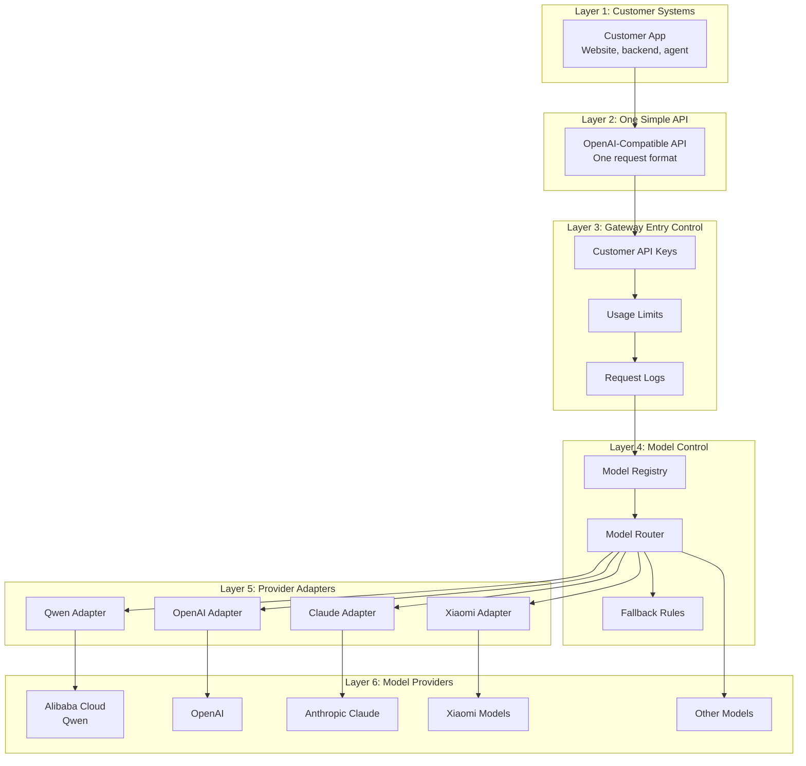

# AI Model Gateway Prototype

This repository is for a small AI Model Gateway prototype.

The goal is to give customers one simple API for many AI model providers.

Example providers:

- Alibaba Cloud Model Studio / Qwen
- OpenAI
- Claude
- Xiaomi models
- Other model providers

## Layered Picture

The customer uses one API.

Behind that API, we can connect to many model providers.



## Why This Project Exists

A normal API Gateway is useful, but it is not enough for multi-model AI integration.

An API Gateway can manage traffic, authentication, rate limits, and logs.

But a Model Gateway must also understand model-specific differences.

For example:

- Request format
- Response format
- Streaming format
- Error format
- Tool calling format
- Token usage
- Model capability
- Fallback routing

## Does This Include API Gateway Features?

Yes, but only the minimum features needed for the prototype.

The prototype includes:

- Customer API keys
- Basic usage limits
- Basic request logs
- Basic usage tracking
- Model routing

It does not replace a full enterprise API Gateway.

A full enterprise API Gateway can still be added later for WAF, advanced security, IP allowlist, advanced rate limits, audit policy, and global traffic control.

## Simple Explanation

Think of the Model Gateway as a translator and traffic controller for AI models.

The customer asks one question in one format.

The Model Gateway decides which model provider to use, changes the request into that provider's format, calls the provider, and changes the answer back into one standard format.

## First Prototype

The first prototype should be small.

It should support:

- `GET /v1/models`
- `POST /v1/chat/completions`
- OpenAI-compatible request and response format
- Simple model registry
- Simple provider adapters
- Basic API key authentication
- Basic usage limits
- Basic request logs

## Try It Locally

The first version can run without paid model calls.

Start in mock mode:

```bash
python3 model_gateway.py --mock
```

Open the visual dashboard:

```text
http://127.0.0.1:8787/
```

The dashboard is designed for customer explanation. It shows:

- The layered architecture
- Gateway entry control
- Model routing
- Provider adapters
- Available models
- Route simulation from `smart-fast` to `qwen-plus`
- A test chat request form

List models:

```bash
curl http://127.0.0.1:8787/v1/models \
  -H "Authorization: Bearer dev-gateway-key"
```

Call chat completion in mock mode:

```bash
curl http://127.0.0.1:8787/v1/chat/completions \
  -H "Authorization: Bearer dev-gateway-key" \
  -H "Content-Type: application/json" \
  -d '{
    "model": "smart-fast",
    "messages": [
      {
        "role": "user",
        "content": "Explain this gateway in one short sentence."
      }
    ],
    "stream": false
  }'
```

To call Alibaba Cloud Model Studio / Qwen for real:

```bash
export DASHSCOPE_API_KEY="your-model-studio-api-key"
python3 model_gateway.py
```

More examples:

[Gateway_Curl_Examples.md](./Gateway_Curl_Examples.md)

## Customer Materials

Use these files for customer explanation:

- [Model_Gateway_Customer_Guide.md](./Model_Gateway_Customer_Guide.md)
- [Model_Gateway_Customer_Guide.pdf](./Model_Gateway_Customer_Guide.pdf)

The guide explains the direction, architecture, demo, routing simulation, technical challenges, roadmap, and reference documents.

## Main Document

Read the prototype plan here:

[Model_Gateway_Prototype.md](./Model_Gateway_Prototype.md)

## References

This design is inspired by public model-router products such as OpenRouter.

OpenRouter references:

- [OpenRouter API Reference](https://openrouter.ai/docs/api/reference/overview/)
- [OpenRouter Authentication](https://openrouter.ai/docs/api-keys)
- [OpenRouter Limits](https://openrouter.ai/docs/api-reference/limits/)
- [OpenRouter Models API](https://openrouter.ai/docs/api/api-reference/models/get-models)
- [OpenRouter Model Fallbacks](https://openrouter.ai/docs/guides/routing/model-fallbacks)
