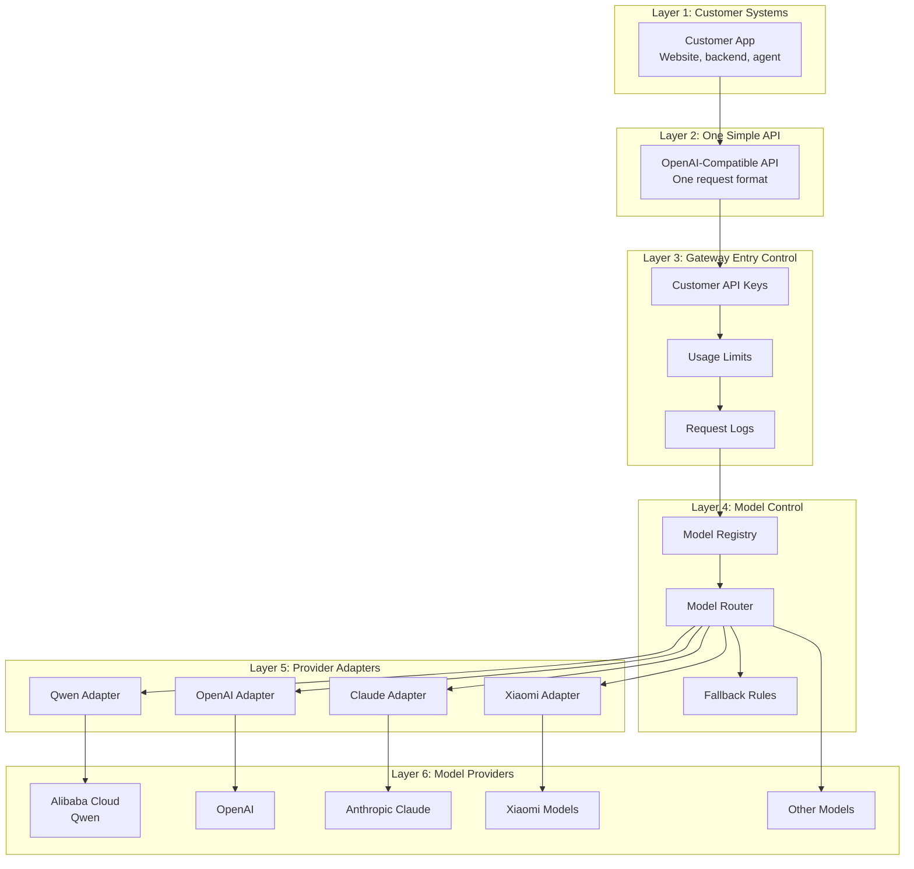

# AI Model Gateway Prototype

In one sentence: this project is a small demo of an "AI model switchboard" that lets a customer use one API while the system decides which AI model provider to call behind the scenes.

For non-technical readers:

- The customer sends one request to one place.
- The gateway checks the request, chooses a model, and routes it to the right provider.
- The current demo uses mock mode, so it can explain the idea without spending real model credits.

This repository is for a small AI Model Gateway prototype.

The goal is to give customers one simple API for many AI model providers.

This is still a prototype, not a production OpenRouter clone.

It is useful because it shows the main building blocks:

- Customer keys
- Model aliases
- Provider adapters
- Fallback routing
- Streaming
- Usage records
- A small admin view
- Persistent SQLite storage

Example providers:

- Alibaba Cloud Model Studio / Qwen
- OpenAI
- Claude
- Xiaomi models
- Other model providers

## Layered Picture

The customer uses one API.

Behind that API, we can connect to many model providers.



## Why This Project Exists

A normal API Gateway is useful, but it is not enough for multi-model AI integration.

An API Gateway can manage traffic, authentication, rate limits, and logs.

But a Model Gateway must also understand model-specific differences.

For example:

- Request format
- Response format
- Streaming format
- Error format
- Tool calling format
- Token usage
- Model capability
- Fallback routing

## Does This Include API Gateway Features?

Yes, but only the minimum features needed for the prototype.

The prototype includes:

- Multiple customer API keys from `customer_keys.json`
- Basic per-customer usage limits
- Per-customer token and cost budgets
- JSONL request logs
- JSONL usage records
- SQLite request and usage storage in `data/aismallrouter.db`
- Model routing
- Mock fallback routing
- Mock and live streaming support
- Mock tool calling response shape
- Bring Your Own Key provider mapping through `provider_api_keys`
- Provider adapter scaffolds for OpenAI-compatible APIs and Anthropic-style APIs
- A simple admin page

It does not replace a full enterprise API Gateway.

A full enterprise API Gateway can still be added later for WAF, advanced security, IP allowlist, advanced rate limits, audit policy, and global traffic control.

## Simple Explanation

Think of the Model Gateway as a translator and traffic controller for AI models.

The customer asks one question in one format.

The Model Gateway decides which model provider to use, changes the request into that provider's format, calls the provider, and changes the answer back into one standard format.

## First Prototype

The first prototype should be small.

It should support:

- `GET /v1/models`
- `POST /v1/chat/completions`
- OpenAI-compatible request and response format
- Simple model registry
- Simple provider adapters
- Basic API key authentication
- Basic usage limits
- Basic request logs

The current version also supports:

- `GET /admin`
- `GET /v1/gateway/status`
- `GET /v1/gateway/alerts`
- `GET /v1/gateway/requests`
- `GET /v1/gateway/usage`
- `GET /v1/gateway/customers`
- `GET /v1/gateway/providers`
- `GET /v1/gateway/provider-health`
- `GET /v1/gateway/model-catalog`
- `POST /v1/gateway/route-preview`
- `GET /v1/gateway/customer-reports`
- `GET /v1/gateway/request-activity`
- `GET /v1/gateway/request-detail`
- `GET /v1/gateway/customer-usage`
- `GET /v1/gateway/model-usage`
- `GET /v1/gateway/request-summary`
- `GET /v1/gateway/config-check`
- `stream=true` Server-Sent Events
- `gateway_force_failover=true` for fallback testing in mock mode
- OpenAI-style `tools` request with mock tool call response
- provider readiness view for mock-ready, live-ready, and degraded providers
- model catalog with provider status, fallback chain, usage, and pricing metadata
- route preview dry run before a real provider call
- customer usage reports with request count, errors, token usage, and budget state
- request activity feed with simple filters for troubleshooting
- request detail lookup by `request_id`
- operational alerts with next steps
- multiple customer keys through `customer_keys.json`
- customer plans with request limits, token budgets, and cost budgets
- SQLite persistence for request and usage records
- disabled example provider configs for OpenAI and Anthropic

## Admin Access

Admin pages and admin JSON endpoints use a separate admin key.

The local demo admin key is:

```text
dev-admin-key
```

Open the admin page:

```text
http://127.0.0.1:8787/admin?admin_key=dev-admin-key
```

Fetch admin JSON:

```bash
curl http://127.0.0.1:8787/v1/gateway/status \
  -H "Authorization: Bearer dev-admin-key"
```

Run a local config check:

```bash
curl http://127.0.0.1:8787/v1/gateway/config-check \
  -H "Authorization: Bearer dev-admin-key"
```

The config check warns about demo keys, missing live provider keys, and direct secret values in local config files.

For production, change the key with `GATEWAY_ADMIN_API_KEY`.

## Operational Alerts

The gateway has an alerts endpoint:

```bash
curl http://127.0.0.1:8787/v1/gateway/alerts \
  -H "Authorization: Bearer dev-admin-key"
```

It combines:

- config check warnings
- provider readiness
- customer budget state
- recent request errors

Each alert includes a `next_step`.

This helps non-technical users understand what needs attention before a live customer demo.

## Provider Health

The gateway has a simple provider health endpoint:

```bash
curl http://127.0.0.1:8787/v1/gateway/provider-health \
  -H "Authorization: Bearer dev-admin-key"
```

It shows:

- whether a provider can be used in mock mode
- whether a provider has a real live key path
- which public models use that provider
- recent request count, errors, and average latency

This is not a paid provider ping.

It is a local readiness view based on configuration and recent gateway traffic.

## Model Catalog

The gateway has a model catalog endpoint:

```bash
curl http://127.0.0.1:8787/v1/gateway/model-catalog \
  -H "Authorization: Bearer dev-admin-key"
```

It shows:

- public model name
- upstream model name
- provider
- provider health status
- fallback chain
- capabilities
- pricing metadata
- request count, errors, tokens, and estimated cost

This helps explain the routing plan.

The customer sees a simple model name.

The gateway keeps the provider details behind it.

## Route Preview

The gateway has a dry-run route preview endpoint:

```bash
curl http://127.0.0.1:8787/v1/gateway/route-preview \
  -H "Authorization: Bearer dev-admin-key" \
  -H "Content-Type: application/json" \
  -d '{
    "customer_id": "dev",
    "model": "smart-fast"
  }'
```

It does not call the provider.

It shows:

- whether the customer can use the model
- current budget state
- route candidates
- fallback order
- upstream model names
- provider readiness

This is useful before a live demo or customer test.

## Customer Reports

The gateway has a customer report endpoint:

```bash
curl http://127.0.0.1:8787/v1/gateway/customer-reports \
  -H "Authorization: Bearer dev-admin-key"
```

It shows one report per customer.

Each report includes:

- plan name
- request count
- error count
- token usage
- remaining token and cost budget
- top models and providers used by that customer
- recent requests for quick troubleshooting

This helps explain the business layer.

The customer does not only buy model access.

The customer also needs limits, reports, and accountability.

## Request Activity

The gateway has a request activity endpoint:

```bash
curl "http://127.0.0.1:8787/v1/gateway/request-activity?customer_id=dev&status=success&limit=10" \
  -H "Authorization: Bearer dev-admin-key"
```

It can filter by:

- `customer_id`
- `model`
- `provider`
- `code`
- `status=success`
- `status=error`
- `limit`

This is useful when a customer asks:

Why did this request fail?

Which model did it use?

Which provider did it route to?

## Request Detail

Every successful chat response includes a gateway request id:

```json
{
  "gateway": {
    "request_id": "abc123..."
  }
}
```

Use it to look up one request:

```bash
curl "http://127.0.0.1:8787/v1/gateway/request-detail?request_id=abc123" \
  -H "Authorization: Bearer dev-admin-key"
```

It shows the request route, outcome, latency, and nearby usage record.

## Customer Plans And Budgets

Each customer can have a simple plan in `customer_keys.json`.

Example:

```json
{
  "id": "demo-budget",
  "plan": "budget-demo",
  "api_key": "demo-budget-key",
  "request_limit": 20,
  "limit_window_seconds": 60,
  "token_budget": 40,
  "cost_budget": 0.1,
  "allowed_models": ["smart-fast"]
}
```

Simple meaning:

- `request_limit` controls how many requests the customer can send in a short time window.
- `token_budget` controls total token usage recorded in SQLite.
- `cost_budget` controls estimated total cost recorded in SQLite.
- `allowed_models` controls which public model names the customer can use.

If a budget is reached, the gateway returns `402` with a clear error code.

## What Is Still Hard

The hard part is not receiving an HTTP request.

The hard part is making many model providers feel like one product.

Important hard parts:

- Different providers use different request formats.
- Streaming events are not exactly the same across providers.
- Tool calling needs request and response normalization.
- Token usage and pricing need careful calculation.
- Customer keys must be protected.
- Provider errors need clean fallback behavior.
- Logs must be useful for support and billing.
- Production rate limits usually need Redis or another shared store.
- Real billing needs a database, invoices, refunds, and customer reporting.

## Bring Your Own Key

Some customers may want to use their own provider account.

This is called Bring Your Own Key, or BYOK.

In this prototype, a customer can map a provider to an environment variable:

```json
{
  "id": "dev",
  "api_key": "dev-gateway-key",
  "provider_api_keys": {
    "dashscope": "env:DASHSCOPE_API_KEY"
  }
}
```

This means:

- The customer still calls the gateway with `dev-gateway-key`.
- The gateway calls DashScope with `DASHSCOPE_API_KEY`.
- The real provider key is not returned by the admin APIs.

For production, provider keys should be encrypted in a secret manager.

## Try It Locally

The first version can run without paid model calls.

Start in mock mode:

```bash
python3 model_gateway.py --mock
```

Open the visual dashboard:

```text
http://127.0.0.1:8787/
```

The dashboard is designed for customer explanation. It shows:

- The layered architecture
- Gateway entry control
- Model routing
- Provider adapters
- Available models
- Route simulation from `smart-fast` to `qwen-plus`
- A test chat request form

Open the admin page:

```text
http://127.0.0.1:8787/admin
```

The admin page shows recent request logs and usage records.

It reads from SQLite, so the records stay after the server restarts.

List models:

```bash
curl http://127.0.0.1:8787/v1/models \
  -H "Authorization: Bearer dev-gateway-key"
```

Call chat completion in mock mode:

```bash
curl http://127.0.0.1:8787/v1/chat/completions \
  -H "Authorization: Bearer dev-gateway-key" \
  -H "Content-Type: application/json" \
  -d '{
    "model": "smart-fast",
    "messages": [
      {
        "role": "user",
        "content": "Explain this gateway in one short sentence."
      }
    ],
    "stream": false
  }'
```

Test tool calling shape in mock mode:

```bash
curl http://127.0.0.1:8787/v1/chat/completions \
  -H "Authorization: Bearer dev-gateway-key" \
  -H "Content-Type: application/json" \
  -d '{
    "model": "smart-fast",
    "messages": [
      {
        "role": "user",
        "content": "Check the weather."
      }
    ],
    "tools": [
      {
        "type": "function",
        "function": {
          "name": "get_weather",
          "description": "Get weather for a city.",
          "parameters": {
            "type": "object",
            "properties": {
              "city": {
                "type": "string"
              }
            },
            "required": ["city"]
          }
        }
      }
    ],
    "tool_choice": "auto",
    "stream": false
  }'
```

Test fallback in mock mode:

```bash
curl http://127.0.0.1:8787/v1/chat/completions \
  -H "Authorization: Bearer dev-gateway-key" \
  -H "Content-Type: application/json" \
  -d '{
    "model": "smart-fast",
    "gateway_force_failover": true,
    "messages": [
      {
        "role": "user",
        "content": "Show fallback routing."
      }
    ],
    "stream": false
  }'
```

Disable fallback for one request:

```bash
curl http://127.0.0.1:8787/v1/chat/completions \
  -H "Authorization: Bearer dev-gateway-key" \
  -H "Content-Type: application/json" \
  -d '{
    "model": "smart-fast",
    "gateway_force_failover": true,
    "gateway_disable_fallback": true,
    "messages": [
      {
        "role": "user",
        "content": "Do not use fallback for this request."
      }
    ],
    "stream": false
  }'
```

Choose fallback models for one request:

```bash
curl http://127.0.0.1:8787/v1/chat/completions \
  -H "Authorization: Bearer dev-gateway-key" \
  -H "Content-Type: application/json" \
  -d '{
    "model": "smart-fast",
    "gateway_force_failover": true,
    "gateway_fallback_models": ["qwen-turbo"],
    "messages": [
      {
        "role": "user",
        "content": "Use my fallback list."
      }
    ],
    "stream": false
  }'
```

Test streaming in mock mode:

```bash
curl -N http://127.0.0.1:8787/v1/chat/completions \
  -H "Authorization: Bearer dev-gateway-key" \
  -H "Content-Type: application/json" \
  -d '{
    "model": "smart-fast",
    "messages": [
      {
        "role": "user",
        "content": "Stream a short answer."
      }
    ],
    "stream": true
  }'
```

To call Alibaba Cloud Model Studio / Qwen for real:

```bash
export DASHSCOPE_API_KEY="your-model-studio-api-key"
python3 model_gateway.py
```

More examples:

[Gateway_Curl_Examples.md](./Gateway_Curl_Examples.md)

## Run Regression Tests

The test file uses only the Python standard library.

It starts the gateway in mock mode on a temporary port.

It does not call paid providers.

```bash
python3 test_gateway.py
```

The tests check:

- Invalid API key rejection
- Model listing
- Chat completion route tracing
- SQLite request and usage records
- Forced fallback routing
- Customer model access rules
- Token budget blocking
- Status output without leaking provider keys
- Provider health readiness output
- Model catalog routing output
- Route preview dry-run output
- Customer usage report output
- Request activity filtering
- Request detail lookup
- Operational alerts output
- Provider, customer, model, and request summary admin endpoints

## Customer Materials

Use these files for customer explanation:

- [Model_Gateway_Customer_Guide.md](./Model_Gateway_Customer_Guide.md)
- [Model_Gateway_Customer_Guide.pdf](./Model_Gateway_Customer_Guide.pdf)

The guide explains the direction, architecture, demo, routing simulation, technical challenges, roadmap, and reference documents.

## Main Document

Read the prototype plan here:

[Model_Gateway_Prototype.md](./Model_Gateway_Prototype.md)

## References

This design is inspired by public model-router products such as OpenRouter.

OpenRouter references:

- [OpenRouter API Reference](https://openrouter.ai/docs/api/reference/overview/)
- [OpenRouter Authentication](https://openrouter.ai/docs/api-keys)
- [OpenRouter Limits](https://openrouter.ai/docs/api-reference/limits/)
- [OpenRouter Models API](https://openrouter.ai/docs/api/api-reference/models/get-models)
- [OpenRouter Model Fallbacks](https://openrouter.ai/docs/guides/routing/model-fallbacks)
