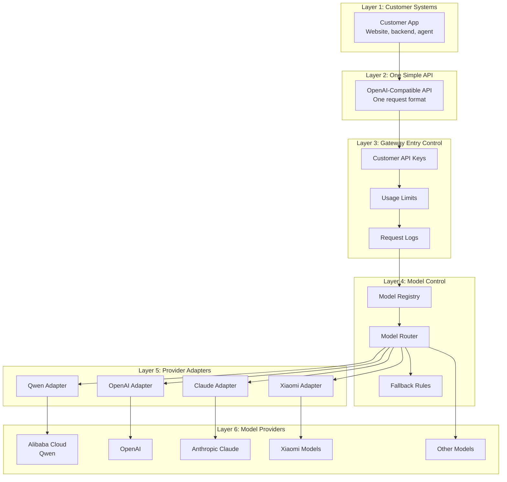

# AI Model Gateway Prototype

In one sentence: this project is a small demo of an "AI model switchboard" that lets a customer use one API while the system decides which AI model provider to call behind the scenes.

For non-technical readers:

- The customer sends one request to one place.
- The gateway checks the request, chooses a model, and routes it to the right provider.
- The current demo uses mock mode, so it can explain the idea without spending real model credits.

This repository is for a small AI Model Gateway prototype.

The goal is to give customers one simple API for many AI model providers.

This is still a prototype, not a production OpenRouter clone.

It is useful because it shows the main building blocks:

- Customer keys
- Model aliases
- Provider adapters
- Fallback routing
- Streaming
- Usage records
- A small admin view
- Persistent SQLite storage

Example providers:

- Alibaba Cloud Model Studio / Qwen
- OpenAI
- Claude
- Xiaomi models
- Other model providers

## Layered Picture

The customer uses one API.

Behind that API, we can connect to many model providers.



## Why This Project Exists

A normal API Gateway is useful, but it is not enough for multi-model AI integration.

An API Gateway can manage traffic, authentication, rate limits, and logs.

But a Model Gateway must also understand model-specific differences.

For example:

- Request format
- Response format
- Streaming format
- Error format
- Tool calling format
- Token usage
- Model capability
- Fallback routing

## Does This Include API Gateway Features?

Yes, but only the minimum features needed for the prototype.

The prototype includes:

- Multiple customer API keys from `customer_keys.json`
- Basic per-customer usage limits
- Per-customer token and cost budgets
- JSONL request logs
- JSONL usage records
- SQLite request and usage storage in `data/aismallrouter.db`
- Model routing
- Mock fallback routing
- Mock and live streaming support
- Mock tool calling response shape
- Bring Your Own Key provider mapping through `provider_api_keys`
- Provider adapter scaffolds for OpenAI-compatible APIs and Anthropic-style APIs
- A simple admin page

It does not replace a full enterprise API Gateway.

A full enterprise API Gateway can still be added later for WAF, advanced security, IP allowlist, advanced rate limits, audit policy, and global traffic control.

## Simple Explanation

Think of the Model Gateway as a translator and traffic controller for AI models.

The customer asks one question in one format.

The Model Gateway decides which model provider to use, changes the request into that provider's format, calls the provider, and changes the answer back into one standard format.

## First Prototype

The first prototype should be small.

It should support:

- `GET /v1/models`
- `GET /v1/gateway/me`
- `GET /v1/gateway/integration-guide`
- `POST /v1/chat/completions`
- OpenAI-compatible request and response format
- Simple model registry
- Simple provider adapters
- Basic API key authentication
- Basic usage limits
- Basic request logs

The current version also supports:

- `GET /admin`
- `GET /openapi.json`
- `GET /postman_collection.json`
- `GET /v1/gateway/demo-bundle`
- `GET /v1/gateway/status`
- `GET /v1/gateway/audit-events`
- `GET /v1/gateway/alerts`
- `GET /v1/gateway/incident-playbook`
- `GET /v1/gateway/support-policy`
- `GET /v1/gateway/pilot-checklist`
- `GET /v1/gateway/onboarding-plan`
- `GET /v1/gateway/launch-plan`
- `GET /v1/gateway/change-management`
- `GET /v1/gateway/data-governance`
- `GET /v1/gateway/executive-brief`
- `GET /v1/gateway/roadmap`
- `GET /v1/gateway/decision-guide`
- `GET /v1/gateway/faq`
- `GET /v1/gateway/demo-script`
- `GET /v1/gateway/access-matrix`
- `GET /v1/gateway/requests`
- `GET /v1/gateway/usage`
- `GET /v1/gateway/customers`
- `GET /v1/gateway/providers`
- `GET /v1/gateway/provider-health`
- `GET /v1/gateway/provider-contracts`
- `GET /v1/gateway/policy-presets`
- `GET /v1/gateway/model-catalog`
- `POST /v1/gateway/route-preview`
- `POST /v1/gateway/cost-estimate`
- `POST /v1/gateway/key-issue-preview`
- `POST /v1/gateway/customers`
- `POST /v1/gateway/customers/rotate-key`
- `POST /v1/gateway/customers/disable`
- `POST /v1/gateway/providers`
- `POST /v1/gateway/providers/update`
- `POST /v1/gateway/providers/disable`
- `POST /v1/gateway/model-routes`
- `POST /v1/gateway/model-routes/update`
- `POST /v1/gateway/model-routes/disable`
- `POST /v1/gateway/safety-preview`
- `GET /v1/gateway/customer-reports`
- `GET /v1/gateway/customer-success`
- `GET /v1/gateway/invoice-preview`
- `GET /v1/gateway/request-activity`
- `GET /v1/gateway/request-detail`
- `GET /v1/gateway/customer-usage`
- `GET /v1/gateway/model-usage`
- `GET /v1/gateway/request-summary`
- `GET /v1/gateway/config-check`
- `GET /v1/gateway/production-readiness`
- customer self-service view for allowed models, budget, usage, and invoice preview
- customer integration guide with quickstart steps, curl, Python, JavaScript, streaming, and go-live checklist
- `stream=true` Server-Sent Events
- `gateway_force_failover=true` for fallback testing in mock mode
- OpenAI-style `tools` request with mock tool call response
- provider readiness view for mock-ready, live-ready, and degraded providers
- provider contract matrix for Qwen, OpenAI-compatible APIs, Claude, and planned providers
- model catalog with provider status, fallback chain, usage, and pricing metadata
- route preview dry run before a real provider call
- structured route decision summary for support explanations
- capability routing control for `streaming` and `tools`
- cost estimate dry run for prompt tokens, completion tokens, and budget impact
- customer key issue preview for safe onboarding demos
- persistent customer create, key rotation, and customer disable actions
- audit events for customer key lifecycle actions
- provider create, update, and disable actions
- model route create, update, and disable actions
- local safety preview for obvious emails, phone numbers, and secrets
- invoice preview with JSON and CSV output
- request-level provider allow-list with `gateway_allowed_providers`
- request-level route strategy with `gateway_route_strategy`
- named policy presets with `gateway_policy`
- customer default policy for automatic routing presets
- customer usage reports with request count, errors, token usage, and budget state
- request activity feed with simple filters for troubleshooting
- request detail lookup by `request_id`
- operational alerts with next steps
- incident playbook with support scenarios and customer-safe wording
- support policy with prototype, pilot, and production support stages
- pilot checklist for before, during, and after a customer trial
- executive brief for non-technical customer stakeholders
- roadmap from prototype to pilot, production hardening, and multi-provider expansion
- decision guide comparing API Gateway, managed AI Gateway, custom Model Gateway, and OpenRouter-like options
- FAQ for common customer questions and objections
- demo script for a 15 minute customer walkthrough
- production readiness report for go-live gaps
- customer model access matrix
- customer self-service profile with no provider secret exposure
- customer integration guide with safe code examples and no provider secret exposure
- multiple customer keys through `customer_keys.json`
- customer plans with request limits, token budgets, and cost budgets
- SQLite persistence for request and usage records
- disabled example provider configs for OpenAI and Anthropic
- provider type contracts for OpenAI-compatible, Anthropic, and planned Xiaomi-style providers
- incident playbook for provider, request, budget, key, and contract issues
- support policy for SLA-stage discussion without pretending the prototype has a legal SLA
- pilot checklist for scope, roles, success criteria, and exit decision
- executive brief for business value, demo story, risks, and next step
- roadmap for phased prototype-to-production planning
- decision guide for build-or-buy gateway discussion
- FAQ for API Gateway, OpenRouter, cost, safety, provider, pilot, and production questions
- demo script for presenter talk track, endpoints to show, and likely questions
- OpenAPI contract at `/openapi.json`
- Postman collection at `/postman_collection.json`
- demo bundle manifest at `/v1/gateway/demo-bundle`
- production readiness report at `/v1/gateway/production-readiness`

## API Contract

The gateway exposes an OpenAPI contract:

```bash
curl http://127.0.0.1:8787/openapi.json
```

This describes the customer API and admin control-plane API.

It includes:

- customer bearer auth
- admin bearer auth
- OpenAI-compatible model and chat endpoints
- customer self view
- customer integration guide
- provider, model route, customer, audit, billing, safety, and reporting endpoints

This can help a customer technical team import the prototype into Postman, Swagger tools, or SDK generators.

The gateway also exposes a Postman collection:

```bash
curl http://127.0.0.1:8787/postman_collection.json
```

The collection includes demo variables:

- `base_url`
- `gateway_api_key`
- `admin_api_key`

It groups requests into Customer API and Admin Control Plane folders.

The gateway also exposes an admin demo bundle:

```bash
curl http://127.0.0.1:8787/v1/gateway/demo-bundle \
  -H "Authorization: Bearer dev-admin-key"
```

The demo bundle is a simple JSON manifest.

It points to:

- the visual dashboard
- the customer self view
- the OpenAPI contract
- the Postman collection
- the customer guide PDF
- the dashboard presenter mode
- the dashboard customer handoff package
- a recommended demo order
- safe curl examples
- production notes

This helps a non-technical customer understand the story first, then gives their technical team the right artifacts.

## Customer Integration Guide

A customer can also ask the gateway how to connect:

```bash
curl http://127.0.0.1:8787/v1/gateway/integration-guide \
  -H "Authorization: Bearer dev-gateway-key"
```

This returns:

- the customer's public gateway profile
- the allowed public model names
- a recommended first model
- curl examples
- Python example
- JavaScript example
- streaming example
- go-live checklist

It uses placeholders like `YOUR_GATEWAY_API_KEY`.

The dashboard also shows an **Integration command starter** with copy-ready local curl commands.

It does not expose provider API keys.

## Customer SDK Starter

A customer can request starter files for the first project integration:

```bash
curl http://127.0.0.1:8787/v1/gateway/sdk-starter \
  -H "Authorization: Bearer dev-gateway-key"
```

This returns:

- `.env.example`
- Python starter file
- JavaScript starter file
- first-run commands
- common error codes and fixes
- customer handoff checklist

It uses `YOUR_GATEWAY_API_KEY` and does not expose the real customer key or provider API keys.

## Admin Access

Admin pages and admin JSON endpoints use a separate admin key.

The local demo admin key is:

```text
dev-admin-key
```

Open the admin page:

```text
http://127.0.0.1:8787/admin?admin_key=dev-admin-key
```

Fetch admin JSON:

```bash
curl http://127.0.0.1:8787/v1/gateway/status \
  -H "Authorization: Bearer dev-admin-key"
```

Run a local config check:

```bash
curl http://127.0.0.1:8787/v1/gateway/config-check \
  -H "Authorization: Bearer dev-admin-key"
```

The config check warns about demo keys, missing live provider keys, and direct secret values in local config files.

Run a production readiness report:

```bash
curl http://127.0.0.1:8787/v1/gateway/production-readiness \
  -H "Authorization: Bearer dev-admin-key"
```

The readiness report groups go-live gaps into plain-English areas:

- security
- provider readiness
- customer controls
- routing and fallback
- observability
- billing
- documentation and handoff

It is not a full security audit.

It is a management-friendly view for explaining what still needs work before production traffic.

The dashboard also shows this as **Production readiness** cards.

## Production Launch Plan

The gateway has a launch plan endpoint:

```bash
curl http://127.0.0.1:8787/v1/gateway/launch-plan \
  -H "Authorization: Bearer dev-admin-key"
```

It converts readiness gaps into go-live gates.

It explains:

- security and secrets gate
- provider live readiness gate
- customer access and budget gate
- routing and fallback gate
- support and observability gate
- billing and commercial rules gate
- customer handoff gate

Each gate has an owner, required evidence, current evidence, approval question, status, and next step.

It also shows required signoffs and rollout stages from internal live test to broader rollout.

## Change Management Plan

The gateway has a change management endpoint:

```bash
curl http://127.0.0.1:8787/v1/gateway/change-management \
  -H "Authorization: Bearer dev-admin-key"
```

It explains how to change customers, providers, or model routes without surprising a customer.

It includes:

- change types
- risk level
- approval owner
- before-change checklist
- after-change validation
- rollback path
- evidence endpoints

This is not automatic rollback yet.

It is a simple operating plan for safer demos, pilots, and production discussions.

For production, change the key with `GATEWAY_ADMIN_API_KEY`.

## Data Governance Review

The gateway has a data governance endpoint:

```bash
curl http://127.0.0.1:8787/v1/gateway/data-governance \
  -H "Authorization: Bearer dev-admin-key"
```

This endpoint explains what happens to prompt data, logs, customer gateway keys, and provider secrets before a customer trusts the gateway.

It covers:

- prompt and response handling
- provider secret handling
- customer gateway key handling
- logging and retention
- sensitive data preview
- customer visibility
- production gaps

This is not a compliance certification.

It is a simple review checklist for customer, security, and business discussions before real production traffic.

For production, the customer and gateway owner still need a clear policy for log retention, deletion, access control, secret rotation, and sensitive data handling.

## Customer Self View

A customer can check their own gateway profile with their own gateway key.

```bash
curl http://127.0.0.1:8787/v1/gateway/me \
  -H "Authorization: Bearer dev-gateway-key"
```

This shows:

- who the customer is
- which public models the customer can use
- current request, token, and cost budget state
- default routing policy, if the customer has one
- usage by model and provider
- recent requests
- invoice preview for this customer

It does not expose the raw customer API key or provider API keys.

## Operational Alerts

The gateway has an alerts endpoint:

```bash
curl http://127.0.0.1:8787/v1/gateway/alerts \
  -H "Authorization: Bearer dev-admin-key"
```

It combines:

- config check warnings
- provider readiness
- customer budget state
- recent request errors

Each alert includes a `next_step`.

This helps non-technical users understand what needs attention before a live customer demo.

## Incident Playbook

The gateway has an incident playbook endpoint:

```bash
curl http://127.0.0.1:8787/v1/gateway/incident-playbook \
  -H "Authorization: Bearer dev-admin-key"
```

It explains common support scenarios:

- provider cannot serve traffic
- recent customer requests are failing
- customer is blocked by budget or limit
- demo key or secret handling risk
- new provider is not ready for customer traffic

Each scenario includes:

- trigger
- signals to check
- current evidence
- operator steps
- customer-safe wording

It is not a legal SLA.

It is a simple support playbook for demos and early customer discussions.

## Support Policy

The gateway has a support policy endpoint:

```bash
curl http://127.0.0.1:8787/v1/gateway/support-policy \
  -H "Authorization: Bearer dev-admin-key"
```

It separates support expectations into:

- prototype demo
- technical pilot
- production target

It also defines:

- P1, P2, and P3 severity meaning
- first checks for each severity
- escalation path
- customer-safe wording
- what is not included in the current prototype

It is not a legal production SLA.

It is a simple way to discuss support scope with a customer before a real contract exists.

## Pilot Checklist

The gateway has a pilot checklist endpoint:

```bash
curl http://127.0.0.1:8787/v1/gateway/pilot-checklist \
  -H "Authorization: Bearer dev-admin-key"
```

It helps prepare a small customer trial.

It covers:

- recommended pilot scope
- business, technical, customer, and support roles
- before pilot checks
- during pilot checks
- after pilot review
- success criteria
- stop, extend, or productionize decision

It helps keep a customer pilot small, honest, and measurable.

## Onboarding Plan

The gateway has a customer onboarding plan endpoint:

```bash
curl http://127.0.0.1:8787/v1/gateway/onboarding-plan \
  -H "Authorization: Bearer dev-admin-key"
```

It turns the demo into a simple pilot path.

It explains:

- Day 0 customer alignment
- Day 1 safe access setup
- Day 2 mock technical test
- Day 3 route and provider review
- Day 4 usage, cost, and support review
- Day 5 pilot decision

Each step has an owner, actions, evidence, and an exit check.

## Executive Brief

The gateway has an executive brief endpoint:

```bash
curl http://127.0.0.1:8787/v1/gateway/executive-brief \
  -H "Authorization: Bearer dev-admin-key"
```

It is a short business summary for non-technical stakeholders.

It explains:

- one-sentence value
- why the gateway matters
- what the demo proves
- what is not production-ready yet
- recommended customer story
- pilot recommendation
- support and readiness position
- next step

## Roadmap

The gateway has a roadmap endpoint:

```bash
curl http://127.0.0.1:8787/v1/gateway/roadmap \
  -H "Authorization: Bearer dev-admin-key"
```

It shows the path from prototype to production:

- prototype explanation
- technical pilot
- production hardening
- multi-provider expansion

Each phase includes:

- goal
- deliverables
- exit criteria
- main risks

## Decision Guide

The gateway has a decision guide endpoint:

```bash
curl http://127.0.0.1:8787/v1/gateway/decision-guide \
  -H "Authorization: Bearer dev-admin-key"
```

It compares:

- normal API Gateway
- managed AI Gateway
- custom Model Gateway
- OpenRouter-like marketplace

It explains what each option is good at, what it does not solve, and when to choose it.

The dashboard also renders this as **Gateway options comparison** cards.

## FAQ

The gateway has a FAQ endpoint:

```bash
curl http://127.0.0.1:8787/v1/gateway/faq \
  -H "Authorization: Bearer dev-admin-key"
```

It answers common questions:

- Is this just an API Gateway?
- Why start with Qwen?
- Is this an OpenRouter clone?
- Will customer prompts or provider keys be exposed?
- How do we control cost?
- What happens if a provider fails?
- Is this ready for production?

## Demo Script

The gateway has a demo script endpoint:

```bash
curl http://127.0.0.1:8787/v1/gateway/demo-script \
  -H "Authorization: Bearer dev-admin-key"
```

It gives a 15 minute customer walkthrough.

The dashboard also renders this as **Presenter mode** so a non-technical customer can follow the story without reading JSON.

It tells the presenter:

- what to say first
- which endpoint to show
- how to explain routing
- how to answer common objections
- how to close with a small pilot

## Access Matrix

The gateway has an access matrix endpoint:

```bash
curl http://127.0.0.1:8787/v1/gateway/access-matrix \
  -H "Authorization: Bearer dev-admin-key"
```

It shows:

- each customer
- each public model
- whether that customer can use that model
- why access is allowed or blocked
- budget state
- provider and provider readiness

This helps explain customer-level API control.

## Provider Health

The gateway has a simple provider health endpoint:

```bash
curl http://127.0.0.1:8787/v1/gateway/provider-health \
  -H "Authorization: Bearer dev-admin-key"
```

It shows:

- whether a provider can be used in mock mode
- whether a provider has a real live key path
- which public models use that provider
- recent request count, errors, and average latency

This is not a paid provider ping.

It is a local readiness view based on configuration and recent gateway traffic.

## Provider Contracts

The gateway has a provider contract matrix:

```bash
curl http://127.0.0.1:8787/v1/gateway/provider-contracts \
  -H "Authorization: Bearer dev-admin-key"
```

This explains why an AI gateway is more than a normal API Gateway.

It compares:

- OpenAI-compatible providers
- Alibaba Cloud Model Studio compatible mode
- Anthropic Claude
- planned Xiaomi or other local model providers

It shows differences in:

- auth
- endpoint path
- request shape
- response shape
- streaming
- tool calling
- usage fields
- adapter status
- remaining contract gaps

## Provider Lifecycle

The admin can create a provider:

```bash
curl http://127.0.0.1:8787/v1/gateway/providers \
  -H "Authorization: Bearer dev-admin-key" \
  -H "Content-Type: application/json" \
  -d '{
    "provider_id": "demo-provider",
    "name": "Demo Provider",
    "type": "openai_compatible",
    "base_url": "https://example.com/v1",
    "api_key_env": "DEMO_PROVIDER_API_KEY"
  }'
```

The admin can update the provider name, type, base URL, API key environment variable, and enabled state:

```bash
curl http://127.0.0.1:8787/v1/gateway/providers/update \
  -H "Authorization: Bearer dev-admin-key" \
  -H "Content-Type: application/json" \
  -d '{
    "provider_id": "demo-provider",
    "name": "Demo Provider Updated",
    "api_key_env": "DEMO_PROVIDER_API_KEY_2"
  }'
```

The admin can disable a provider:

```bash
curl http://127.0.0.1:8787/v1/gateway/providers/disable \
  -H "Authorization: Bearer dev-admin-key" \
  -H "Content-Type: application/json" \
  -d '{"provider_id": "demo-provider"}'
```

Disabling a provider also disables active model routes that point to that provider.

This keeps `model_registry.json` valid and reloads the local runtime safely.

Every provider change writes an audit event.

The dashboard also has a **Provider lifecycle** panel for create, update, and disable demos.

The prototype stores the provider API key environment variable name, not the provider secret value.

Production should use a database, secret manager, approval workflow, readiness checks, and rollout controls.

## Model Catalog

The gateway has a model catalog endpoint:

```bash
curl http://127.0.0.1:8787/v1/gateway/model-catalog \
  -H "Authorization: Bearer dev-admin-key"
```

It shows:

- public model name
- upstream model name
- provider
- provider health status
- fallback chain
- capabilities
- pricing metadata
- request count, errors, tokens, and estimated cost

This helps explain the routing plan.

The customer sees a simple model name.

The gateway keeps the provider details behind it.

## Model Route Lifecycle

The admin can create a public model route:

```bash
curl http://127.0.0.1:8787/v1/gateway/model-routes \
  -H "Authorization: Bearer dev-admin-key" \
  -H "Content-Type: application/json" \
  -d '{
    "model_id": "customer-fast",
    "provider": "dashscope",
    "upstream_model": "qwen-plus",
    "fallback_models": ["qwen-turbo"],
    "capabilities": ["chat", "streaming"],
    "pricing": {
      "prompt_per_1k": 0,
      "completion_per_1k": 0
    }
  }'
```

The admin can update fallback, capabilities, provider, upstream model, and pricing:

```bash
curl http://127.0.0.1:8787/v1/gateway/model-routes/update \
  -H "Authorization: Bearer dev-admin-key" \
  -H "Content-Type: application/json" \
  -d '{
    "model_id": "customer-fast",
    "fallback_models": ["smart-fast"],
    "capabilities": ["chat", "streaming", "tools"]
  }'
```

The admin can disable a route:

```bash
curl http://127.0.0.1:8787/v1/gateway/model-routes/disable \
  -H "Authorization: Bearer dev-admin-key" \
  -H "Content-Type: application/json" \
  -d '{"model_id": "customer-fast"}'
```

This updates `model_registry.json` and reloads the local runtime.

Every route change writes an audit event.

The dashboard also has a **Model route lifecycle** panel for create, update, and disable demos.

Production should add approval workflow, version history, rollback, and staged rollout.

## Route Preview

The gateway has a dry-run route preview endpoint:

```bash
curl http://127.0.0.1:8787/v1/gateway/route-preview \
  -H "Authorization: Bearer dev-admin-key" \
  -H "Content-Type: application/json" \
  -d '{
    "customer_id": "dev",
    "model": "smart-fast"
  }'
```

It does not call the provider.

It shows:

- whether the customer can use the model
- current budget state
- route candidates
- fallback order
- upstream model names
- provider readiness

This is useful before a live demo or customer test.

Route preview and chat responses include `route_decision`.

It explains:

- selected public model
- resolved provider model
- provider
- fallback policy
- provider and capability controls
- simple reasons for the routing decision

## Provider Routing Control

The gateway can limit a request to specific providers.

Example:

```bash
curl http://127.0.0.1:8787/v1/gateway/route-preview \
  -H "Authorization: Bearer dev-admin-key" \
  -H "Content-Type: application/json" \
  -d '{
    "customer_id": "dev",
    "model": "smart-fast",
    "gateway_allowed_providers": ["dashscope"]
  }'
```

This does not call the provider.

It answers a simple question:

Can this customer use this model through these providers?

If no route matches the provider list, the gateway returns a clear error.

This is similar to the routing-control idea used by model router products.

## Routing Strategy

The gateway can reorder route candidates for one request.

Use `gateway_route_strategy`.

Supported values:

- `registry`: use the order in `model_registry.json`
- `lowest_cost`: try the lowest estimated price first
- `fastest`: try the route with the best recent average latency first
- `healthiest`: try the route with the best provider health first

Example:

```bash
curl http://127.0.0.1:8787/v1/gateway/route-preview \
  -H "Authorization: Bearer dev-admin-key" \
  -H "Content-Type: application/json" \
  -d '{
    "customer_id": "dev",
    "model": "smart-fast",
    "gateway_route_strategy": "lowest_cost"
  }'
```

This does not call the provider.

The response includes `candidate_scores` inside `route_decision`.

This is a prototype strategy layer.

Production should add stronger latency windows, cost metadata, provider SLAs, and customer policy rules.

## Policy Presets

The gateway has named policy presets.

They are shortcuts for common routing controls.

List presets:

```bash
curl http://127.0.0.1:8787/v1/gateway/policy-presets \
  -H "Authorization: Bearer dev-admin-key"
```

Use a preset:

```bash
curl http://127.0.0.1:8787/v1/gateway/route-preview \
  -H "Authorization: Bearer dev-admin-key" \
  -H "Content-Type: application/json" \
  -d '{
    "customer_id": "dev",
    "model": "smart-fast",
    "gateway_policy": "lowest_cost"
  }'
```

Current presets:

- `balanced`
- `lowest_cost`
- `fastest`
- `tool_ready`

If the request also sends an explicit gateway control, the explicit request value wins.

For example, `gateway_route_strategy` overrides the strategy inside the preset.

## Customer Default Policy

A customer can have a default routing policy in `customer_keys.json`.

Example:

```json
{
  "id": "customer-demo",
  "api_key": "customer-demo-key",
  "allowed_models": ["smart-fast"],
  "default_policy": "lowest_cost"
}
```

If a request does not send `gateway_policy`, the gateway uses the customer's `default_policy`.

If a request sends `gateway_policy`, the request value wins.

The customer self view shows `default_policy`.

## Capability Routing Control

The gateway can check required model capabilities before a provider call.

Example:

```bash
curl http://127.0.0.1:8787/v1/gateway/route-preview \
  -H "Authorization: Bearer dev-admin-key" \
  -H "Content-Type: application/json" \
  -d '{
    "customer_id": "dev",
    "model": "smart-fast",
    "gateway_required_capabilities": ["tools"]
  }'
```

The gateway also detects capabilities from chat requests:

- `stream=true` requires `streaming`
- `tools` requires `tools`

If no route can support the required capability, the gateway returns `no_capability_route`.

## Cost Estimate

The gateway has a cost estimate endpoint:

```bash
curl http://127.0.0.1:8787/v1/gateway/cost-estimate \
  -H "Authorization: Bearer dev-admin-key" \
  -H "Content-Type: application/json" \
  -d '{
    "customer_id": "dev",
    "model": "smart-fast",
    "prompt": "Explain the gateway.",
    "max_tokens": 256
  }'
```

It does not call the provider.

It estimates:

- prompt tokens
- completion tokens
- estimated cost
- remaining budget after the estimate

This is a planning estimate.

Real provider token usage can be different.

## Customer Key Issue Preview

The gateway can preview a new customer key package:

```bash
curl http://127.0.0.1:8787/v1/gateway/key-issue-preview \
  -H "Authorization: Bearer dev-admin-key" \
  -H "Content-Type: application/json" \
  -d '{
    "customer_id": "customer-demo",
    "name": "Customer Demo",
    "plan": "starter",
    "allowed_models": ["smart-fast"],
    "default_policy": "lowest_cost",
    "request_limit": 60,
    "token_budget": 10000,
    "cost_budget": 1.0
  }'
```

It returns:

- a generated gateway API key
- a masked key for safe display
- a `customer_keys.json` config snippet
- next steps for route preview and reporting

It does not save the customer.

This is a safe way to explain customer onboarding without changing local config.

## Customer Key Lifecycle

The admin can create a customer and save it to `customer_keys.json`:

```bash
curl http://127.0.0.1:8787/v1/gateway/customers \
  -H "Authorization: Bearer dev-admin-key" \
  -H "Content-Type: application/json" \
  -d '{
    "customer_id": "customer-demo",
    "name": "Customer Demo",
    "plan": "starter",
    "allowed_models": ["smart-fast"],
    "default_policy": "lowest_cost",
    "request_limit": 60,
    "token_budget": 10000,
    "cost_budget": 1.0
  }'
```

The response returns the new gateway API key once.

The admin can rotate a customer key:

```bash
curl http://127.0.0.1:8787/v1/gateway/customers/rotate-key \
  -H "Authorization: Bearer dev-admin-key" \
  -H "Content-Type: application/json" \
  -d '{"customer_id": "customer-demo"}'
```

The old key stops working after rotation.

The admin can disable a customer:

```bash
curl http://127.0.0.1:8787/v1/gateway/customers/disable \
  -H "Authorization: Bearer dev-admin-key" \
  -H "Content-Type: application/json" \
  -d '{"customer_id": "customer-demo"}'
```

The disabled customer's gateway key stops working.

The dashboard also has a **Customer lifecycle** panel for preview, create, rotate, and disable demos.

This prototype stores customer keys in local JSON. Production should use a database, audit logs, and a secret manager.

## Audit Events

The gateway records admin lifecycle actions.

```bash
curl "http://127.0.0.1:8787/v1/gateway/audit-events?target_id=customer-demo" \
  -H "Authorization: Bearer dev-admin-key"
```

It shows:

- who performed the action
- what action happened
- which customer, provider, or model route was changed
- when it happened
- safe details such as masked keys and key hashes

It does not store full gateway API keys in the audit event.

The dashboard also has an **Audit timeline** section for recent customer, provider, and model route changes.

This is useful for explaining control history.

It is not a full compliance audit system.

## Invoice Preview

The gateway can preview customer billing data:

```bash
curl "http://127.0.0.1:8787/v1/gateway/invoice-preview?customer_id=dev" \
  -H "Authorization: Bearer dev-admin-key"
```

It shows:

- requests
- errors
- prompt and completion tokens
- estimated cost
- remaining budget
- usage by model and provider

CSV export is also available:

```bash
curl "http://127.0.0.1:8787/v1/gateway/invoice-preview?customer_id=dev&format=csv" \
  -H "Authorization: Bearer dev-admin-key"
```

This is not a legal invoice.

It is a local billing preview for customer explanation.

## Safety Preview

The gateway can preview obvious sensitive data before a provider call:

```bash
curl http://127.0.0.1:8787/v1/gateway/safety-preview \
  -H "Authorization: Bearer dev-admin-key" \
  -H "Content-Type: application/json" \
  -d '{
    "messages": [
      {
        "role": "user",
        "content": "My email is user@example.com"
      }
    ]
  }'
```

Chat requests can also opt in:

- `gateway_safety_check=true` returns the safety preview in the gateway metadata.
- `gateway_block_sensitive=true` blocks the request when sensitive data is detected.
- `gateway_redact_sensitive=true` redacts detected sensitive data before the provider call.

This is a simple local preview.

It is not a full DLP or compliance system.

## Customer Reports

The gateway has a customer report endpoint:

```bash
curl http://127.0.0.1:8787/v1/gateway/customer-reports \
  -H "Authorization: Bearer dev-admin-key"
```

It shows one report per customer.

Each report includes:

- plan name
- request count
- error count
- token usage
- remaining token and cost budget
- top models and providers used by that customer
- recent requests for quick troubleshooting

This helps explain the business layer.

The customer does not only buy model access.

The customer also needs limits, reports, and accountability.

## Customer Success Summary

The gateway has a customer success summary endpoint:

```bash
curl http://127.0.0.1:8787/v1/gateway/customer-success \
  -H "Authorization: Bearer dev-admin-key"
```

It turns customer usage data into account health.

It shows:

- healthy, watch, and at-risk customer counts
- health status per customer
- risk reasons
- recommended follow-up action
- simple business metrics
- meeting questions
- evidence endpoints for support

This helps sales, support, and customer success teams decide who needs attention before the next customer call.

## Request Activity

The gateway has a request activity endpoint:

```bash
curl "http://127.0.0.1:8787/v1/gateway/request-activity?customer_id=dev&status=success&limit=10" \
  -H "Authorization: Bearer dev-admin-key"
```

It can filter by:

- `customer_id`
- `model`
- `provider`
- `code`
- `status=success`
- `status=error`
- `limit`

This is useful when a customer asks:

Why did this request fail?

Which model did it use?

Which provider did it route to?

## Request Detail

Every successful chat response includes a gateway request id:

```json
{
  "gateway": {
    "request_id": "abc123..."
  }
}
```

Use it to look up one request:

```bash
curl "http://127.0.0.1:8787/v1/gateway/request-detail?request_id=abc123" \
  -H "Authorization: Bearer dev-admin-key"
```

It shows the request route, outcome, latency, and nearby usage record.

## Customer Plans And Budgets

Each customer can have a simple plan in `customer_keys.json`.

Example:

```json
{
  "id": "demo-budget",
  "plan": "budget-demo",
  "api_key": "demo-budget-key",
  "request_limit": 20,
  "limit_window_seconds": 60,
  "token_budget": 40,
  "cost_budget": 0.1,
  "allowed_models": ["smart-fast"]
}
```

Simple meaning:

- `request_limit` controls how many requests the customer can send in a short time window.
- `token_budget` controls total token usage recorded in SQLite.
- `cost_budget` controls estimated total cost recorded in SQLite.
- `allowed_models` controls which public model names the customer can use.

If a budget is reached, the gateway returns `402` with a clear error code.

## What Is Still Hard

The hard part is not receiving an HTTP request.

The hard part is making many model providers feel like one product.

Important hard parts:

- Different providers use different request formats.
- Streaming events are not exactly the same across providers.
- Tool calling needs request and response normalization.
- Token usage and pricing need careful calculation.
- Customer keys must be protected.
- Provider errors need clean fallback behavior.
- Logs must be useful for support and billing.
- Production rate limits usually need Redis or another shared store.
- Real billing needs a database, invoices, refunds, and customer reporting.

## Bring Your Own Key

Some customers may want to use their own provider account.

This is called Bring Your Own Key, or BYOK.

In this prototype, a customer can map a provider to an environment variable:

```json
{
  "id": "dev",
  "api_key": "dev-gateway-key",
  "provider_api_keys": {
    "dashscope": "env:DASHSCOPE_API_KEY"
  }
}
```

This means:

- The customer still calls the gateway with `dev-gateway-key`.
- The gateway calls DashScope with `DASHSCOPE_API_KEY`.
- The real provider key is not returned by the admin APIs.

For production, provider keys should be encrypted in a secret manager.

## Try It Locally

The first version can run without paid model calls.

Start in mock mode:

```bash
python3 model_gateway.py --mock
```

Open the visual dashboard:

```text
http://127.0.0.1:8787/
```

The dashboard is designed for customer explanation. It shows:

- The layered architecture
- A visual architecture map from customer systems to model providers
- Gateway options comparison for API Gateway, managed AI Gateway, custom Model Gateway, and OpenRouter-like paths
- Production readiness cards for go-live gaps
- Production launch gates before real customer traffic
- Customer success summary for account health and follow-up priority
- Customer handoff package for OpenAPI, Postman, PDF, demo bundle, and GitHub
- Customer onboarding plan from Day 0 to Day 5
- Integration command starter for first curl tests
- Gateway entry control
- Model routing
- Provider adapters
- Available models
- Route simulation from `smart-fast` to `qwen-plus`
- A test chat request form

Open the admin page:

```text
http://127.0.0.1:8787/admin
```

The admin page shows recent request logs and usage records.

It reads from SQLite, so the records stay after the server restarts.

List models:

```bash
curl http://127.0.0.1:8787/v1/models \
  -H "Authorization: Bearer dev-gateway-key"
```

Call chat completion in mock mode:

```bash
curl http://127.0.0.1:8787/v1/chat/completions \
  -H "Authorization: Bearer dev-gateway-key" \
  -H "Content-Type: application/json" \
  -d '{
    "model": "smart-fast",
    "messages": [
      {
        "role": "user",
        "content": "Explain this gateway in one short sentence."
      }
    ],
    "stream": false
  }'
```

Test tool calling shape in mock mode:

```bash
curl http://127.0.0.1:8787/v1/chat/completions \
  -H "Authorization: Bearer dev-gateway-key" \
  -H "Content-Type: application/json" \
  -d '{
    "model": "smart-fast",
    "messages": [
      {
        "role": "user",
        "content": "Check the weather."
      }
    ],
    "tools": [
      {
        "type": "function",
        "function": {
          "name": "get_weather",
          "description": "Get weather for a city.",
          "parameters": {
            "type": "object",
            "properties": {
              "city": {
                "type": "string"
              }
            },
            "required": ["city"]
          }
        }
      }
    ],
    "tool_choice": "auto",
    "stream": false
  }'
```

Test fallback in mock mode:

```bash
curl http://127.0.0.1:8787/v1/chat/completions \
  -H "Authorization: Bearer dev-gateway-key" \
  -H "Content-Type: application/json" \
  -d '{
    "model": "smart-fast",
    "gateway_force_failover": true,
    "messages": [
      {
        "role": "user",
        "content": "Show fallback routing."
      }
    ],
    "stream": false
  }'
```

Disable fallback for one request:

```bash
curl http://127.0.0.1:8787/v1/chat/completions \
  -H "Authorization: Bearer dev-gateway-key" \
  -H "Content-Type: application/json" \
  -d '{
    "model": "smart-fast",
    "gateway_force_failover": true,
    "gateway_disable_fallback": true,
    "messages": [
      {
        "role": "user",
        "content": "Do not use fallback for this request."
      }
    ],
    "stream": false
  }'
```

Choose fallback models for one request:

```bash
curl http://127.0.0.1:8787/v1/chat/completions \
  -H "Authorization: Bearer dev-gateway-key" \
  -H "Content-Type: application/json" \
  -d '{
    "model": "smart-fast",
    "gateway_force_failover": true,
    "gateway_fallback_models": ["qwen-turbo"],
    "messages": [
      {
        "role": "user",
        "content": "Use my fallback list."
      }
    ],
    "stream": false
  }'
```

Test streaming in mock mode:

```bash
curl -N http://127.0.0.1:8787/v1/chat/completions \
  -H "Authorization: Bearer dev-gateway-key" \
  -H "Content-Type: application/json" \
  -d '{
    "model": "smart-fast",
    "messages": [
      {
        "role": "user",
        "content": "Stream a short answer."
      }
    ],
    "stream": true
  }'
```

To call Alibaba Cloud Model Studio / Qwen for real:

```bash
export DASHSCOPE_API_KEY="your-model-studio-api-key"
python3 model_gateway.py
```

More examples:

[Gateway_Curl_Examples.md](./Gateway_Curl_Examples.md)

## Run Regression Tests

The test file uses only the Python standard library.

It starts the gateway in mock mode on a temporary port.

It does not call paid providers.

```bash
python3 test_gateway.py
```

The tests check:

- Invalid API key rejection
- Model listing
- Chat completion route tracing
- SQLite request and usage records
- Forced fallback routing
- Customer model access rules
- Token budget blocking
- Status output without leaking provider keys
- Provider health readiness output
- Model catalog routing output
- Route preview dry-run output
- Cost estimate output
- Data governance review output
- Customer usage report output
- Request activity filtering
- Request detail lookup
- Operational alerts output
- Access matrix output
- Provider, customer, model, and request summary admin endpoints

## Customer Materials

Use these files for customer explanation:

- [Model_Gateway_Customer_Guide.md](./Model_Gateway_Customer_Guide.md)
- [Model_Gateway_Customer_Guide.pdf](./Model_Gateway_Customer_Guide.pdf)

The guide explains the direction, architecture, demo, routing simulation, technical challenges, roadmap, and reference documents.

## Main Document

Read the prototype plan here:

[Model_Gateway_Prototype.md](./Model_Gateway_Prototype.md)

## References

This design is inspired by public model-router products such as OpenRouter.

OpenRouter references:

- [OpenRouter API Reference](https://openrouter.ai/docs/api/reference/overview/)
- [OpenRouter Authentication](https://openrouter.ai/docs/api-keys)
- [OpenRouter Limits](https://openrouter.ai/docs/api-reference/limits/)
- [OpenRouter Models API](https://openrouter.ai/docs/api/api-reference/models/get-models)
- [OpenRouter Model Fallbacks](https://openrouter.ai/docs/guides/routing/model-fallbacks)
